# Project 3: Design Journey

**For each milestone, complete only the sections that are labeled with that milestone.** Refine all sections before the final submission.

You are graded on your design process. If you later need to update your plan, **please do not delete the original plan, leave it in place and append your new plan _below_ the original.** Then explain why you are changing your plan. Any time you update your plan, you're documenting your design process!

**Replace ALL _TODOs_ with your work.** (There should be no TODOs in the final submission.)

Be clear and concise in your writing. Bullets points are encouraged.

**Everything, including images, must be visible in _Markdown: Open Preview_.** If it's not visible in the Markdown preview, then we can't grade it. We also can't give you partial credit either. **Please make sure your design journey should is easy to read for the grader;** in Markdown preview the question _and_ answer should have a blank line between them.


## Existing Project (Milestone 1)

**Tell us about the project you'll be using for Project 3.**

### Project (Milestone 1)
> Which project will you add interactivity to enhance the site's functionality?

Project 2


### Audience (Milestone 1)
> Briefly explain your site's audience.
> Be specific and justify why this audience is a **cohesive** group.

Audience: Nearby area residents (within 20min drive to Ithaca Commons) that has lived here for at least a month.
They are relatively familiar with Commons, and know the buses systems/dining here, and they don't need accommandation suggestions (since they live here).


### Audience's Goals (Milestone 1)
> List the audience's goals that you identified in Project 1 or 2.
> Simply list each goal. No need to include the "Design Ideas and Choices", etc.
> You may adjust the goals if necessary.

- To know location and date of the fest
- Find out what they should expect on the fest (food, apple products, and fun activities)
- how they will have fun with friends
- To be reminded of rules/notices
- Have a map of where to find things


## Interactivity Design (Milestone 1)

### Interactivity Brainstorm (Milestone 1)
> Using the audience goals you identified, brainstorm possible options for interactivity to enhance the functionality of the site while also assisting the audience with their goals.
> Briefly explain each idea and provide a brief rationale for how the interactivity enhances the site's functionality for the audience.
> Note: You may find it easier to sketch for brainstorming. That's fine too. Do whatever you need to do to explore your ideas.

- Make a drop-down menu for wide "food & recreation" page of the nav bar. Users are familiar with drop-dorn munes, and it makes them easier to find the specific items in mind.
- An embedded hamburger menu for narrow screen nav bar.
- A carousel for all the food, apple-made products, and crafts rather than veritcal display. Users can click to view different sections in a same categroies rather than scroll multiple times.
- Perhaps can have an accordian for the FAQ section: hiding all the answers and users can click on a question to show its answer. In this way, audiences can view all the questions more straightforwardly, and only checkout the ones they need.
- might have a gallary picture of photoes
- It can be interesting to have an adaptable view (dark and autumn mode).


### Interactivity Design Ideation (Milestone 1)
> Explore the possible design solutions for the interactivity.
> Sketch several iterations of your interactivity.
> Annotate each sketch explaining what happens when a user takes an action. (e.g. When user clicks this, something else appears.)

dropdown menu:
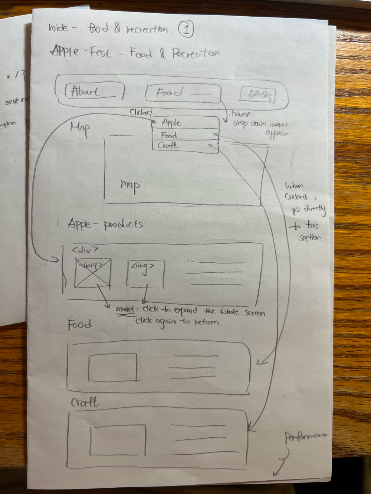
For this iteration, I plan to have a dropdown menu for detailed sections when hovering over "food & recreation" tab in the nav bar. This can direct users to one of the three smaller sections that they are looking for (apple-products, food, or crafts).
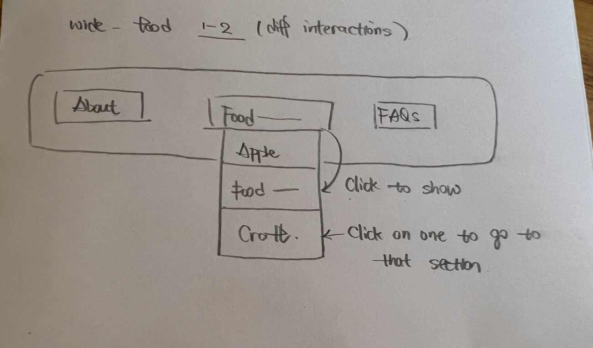
Same dropdown menu as previous one, but user have to click on the button "food&recreation" to see the options, and then they click on one of the three sub-sections appear to go to that page.

carousel:
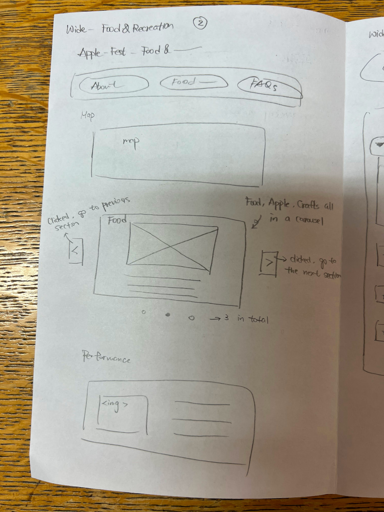
This iteration includes a carousel of pictures of descriptions that contains three sections originally listed vertically: apple-products, food, and crafts. Users can click the left and right arrows to switch to different sections without scrolling, which saticfy their goal of looking for things quickly.

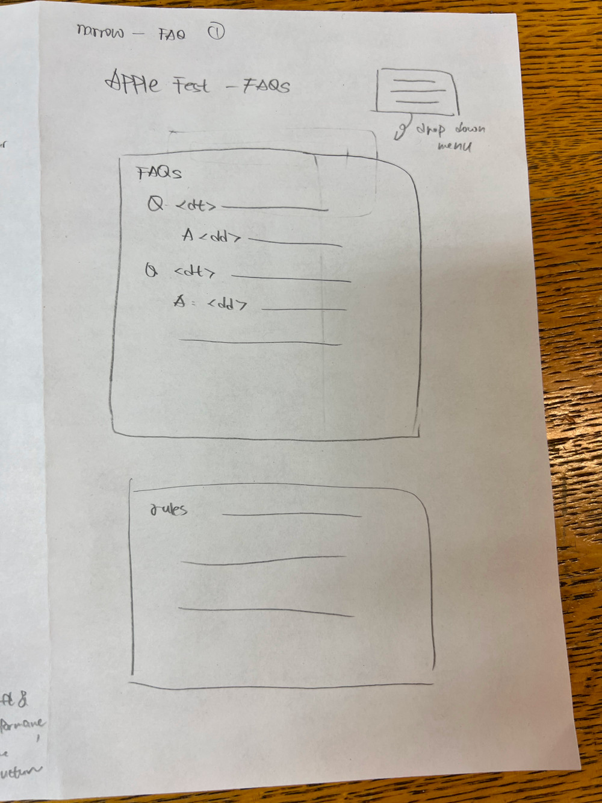
For this iteration of narrow FAQ page, I didn't add any interactions to the Q&A section. Users can just scroll down to check out different questions and the answers are below.
Accordian:
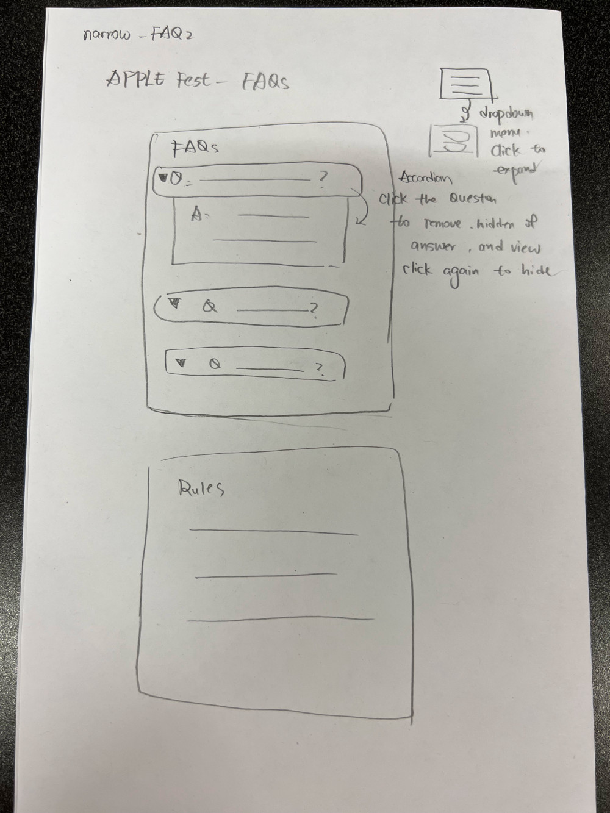
For this iteration of narrow FAQ page, I added an accordian to the Q & A section, since users might sometimes get annoyed for having to scrolling through all the irrevelant questions and long answers to find they one they need. Adding this intractivity can help shorten information user need to view in order to find useful ones.

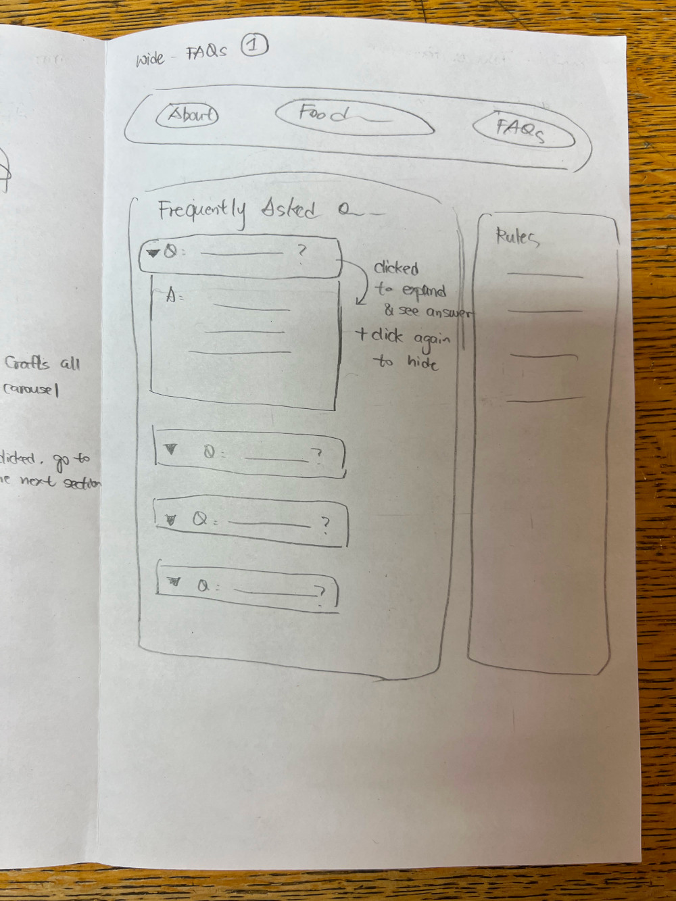
Similar to the second iteration of narrow FAQ page, this page contains an accordian with slightly different designs. When clicked the question, a drop-down bar will appear showing the answer to that question, while all other answers are hidden to save space.

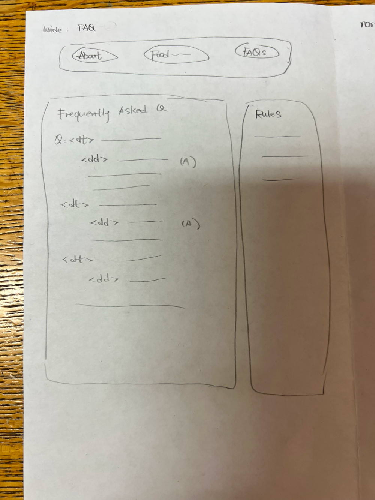
For this iteration, there's no interactivity since all information can be presented without too much scroll on a wide screen, so users might not need the "click-to-show" answers to simplify information presented.


### Final Interactivity Design (Milestone 1)
> Create _polished_ sketch(es) (it's still a sketch, but with a little more care taken to communicate ideas clearly to the graders) to plan your interactivity.
> **Sketch out the entire page where your interactivity will go.**
> Include your interactivity to the sketch(es).
> Add annotations to explain what happens when the user takes an action.
> Include as many sketches as necessary to communicate your design (ask yourself, could another 1300 take these sketches an implement my design?)

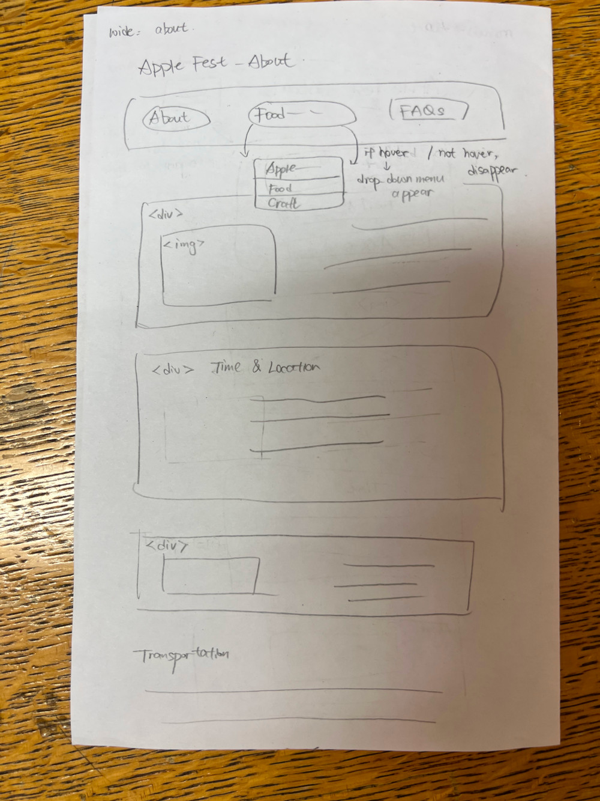
In this page, I includedthe dropdown menu for the "food & recreation" section in the nav bar. Users can be directed to the specific section they are interested in from the nav bar, saving their time for scrolling.


I chose to have a dropdown menu with hovering to show the choices. I think this is a more familiar design in other example websites, so users might think "hover to show" is more intuitive than having to clicking on the button. I'll also not have the carousel since it's a bit unnesessary in terms of helping users reach their goal of finding items they need.


I chose not to include the accordian for wide screen since there aren't that much content and all of them can be clearly displayed on a wide screen without much scrolling. Additional clicking interaction for viewing the "answers" might in turn be a trouble for the users, prevent them from getting what they want from a glimpse.

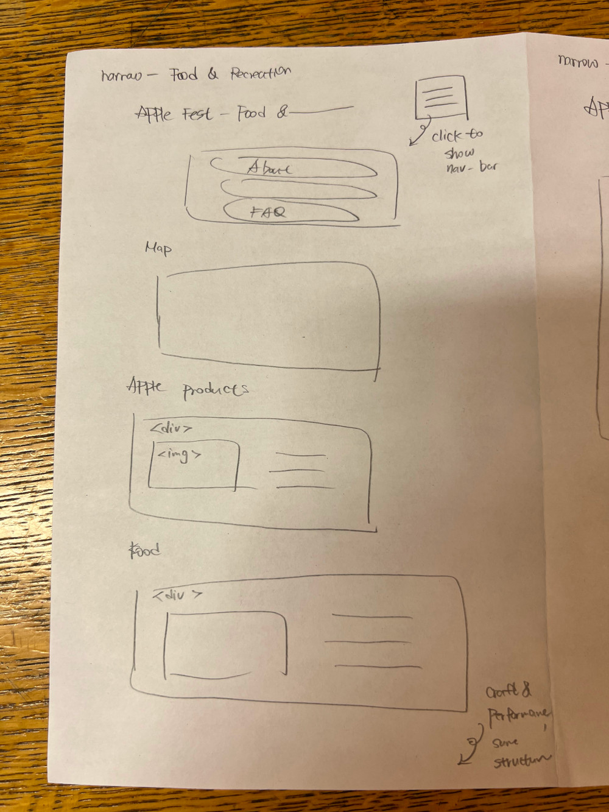
Include the hamburger mune on the top-right corner. If click, it will show the nav bar. This helps saving the small screen space of the narrow screens, so that users can see more contents when they don't need a nav bar.


Like other pages, this page includes the hamburger menu that contains the nav list, and will expand when users click on the icon on the top-right corner. There're no other interactions for this page.


I chose not to have the accordian since the interaction is a bit too complex. This page will have no interactions other than the hamburger menu.

Note: I removed the modal in food&recreation page later on, since the implementation is a bit differnt from what I thought, and might actually make users having extra scrolls to get what they want. So the modal in the sketches are no longer in the website.

### Interactivity Rationale (Milestone 1)
> Describe the purpose of your proposed interactivity.
> Provide a brief rationale explaining how your proposed interactivity addresses the goals of your site's audience.
> This should be about a paragraph. (3-5 sentences)

1. The nav bar interaction design in narrow screen can save space for the main content on a small screen. The large navigation buttons are hidden when users don't need it, and the screen can show more content of the web page at the same time. It address users' goal to queckly get important information about apple fest by removing the large block of nav bar when they don't need it on mobile screens.
2. The dropdown menu in "food and recreation' section helps user to quickly know what's in that page and directly get what they want by one click. The purpose is to save time of users to reach their goals of finding food/crafts info on the website.


## Interactivity Implementation Plan (Milestone 1)

### Interactivity Planning Sketches (Milestone 1)
> Produce planning sketches that include all the details another 1300 student would need to implement your interactivity design.

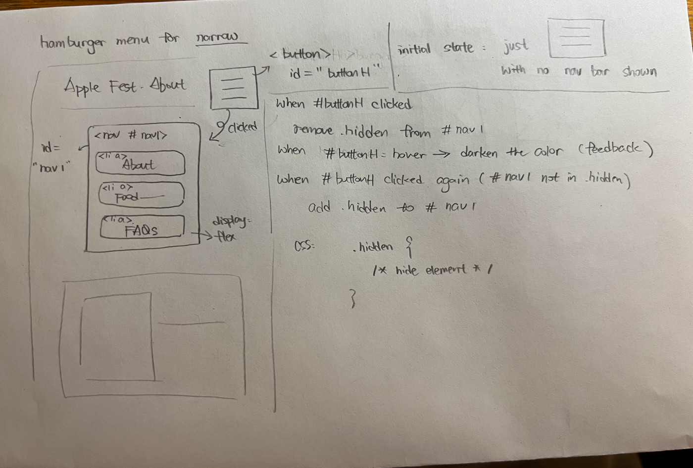
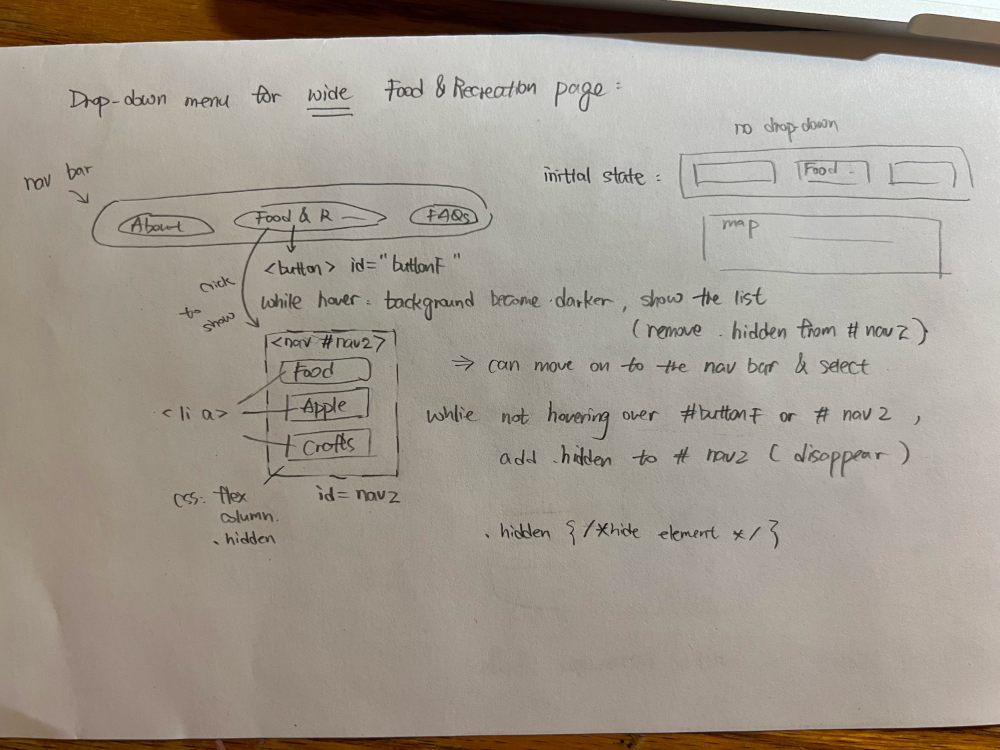
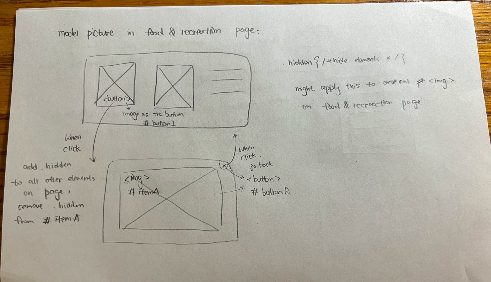
Note: I removed the modal interactivity later on since it's too much to implement, and the effect is different than what I intended.

### Interactivity Pseudocode Plan (Milestone 1)
> Write your interactivity pseudocode plan here.
> Pseudocode is not JavaScript. Please do not put JavaScript code here.

```
For hamburger menu:
when #buttonH is clicked:
    if #nav1 is in .hidden
        remove .hidden from #nav1
    if  #nav1 is not in .hidden
        add .hidden to #nav1

For dropdown menu:
when #buttonF is hovered over:
    remove .hidden from #nav2
when #buttonF is not hovered over and #nav2 is not hovered over:
    add .hidden to #nav2

For modal picture (wide):
when #buttonI clicked:
    add .hidden to all elements on the page,
    remove .hidden from #itemA
when buttonQ clicked:
    remove .hidden to all elements on the page,
    add .hidden remove #itemA

Note: modal is removed when later on I implement the website.
```


### "Ambitious" Interactivity Explanation (Milestone 1)
> In your own words, concisely explain why you believe your interactivity meets the "ambitious" requirement.
> This should be a few sentences. (1-3 sentences)

My interactivity is ambitious enough since it includes a dropdown menu for both narrow and wide screen plus a hamburger menu for narrow screen.


## Grading (Final Submission)

### Interactivity Usability Justification (Final Submission)
> Explain how your design effectively uses affordances, visibility, feedback, and familiarity.
> Write a large paragraph (4-6 sentences)


My interactivity design use visibility since I make the "menu" button for hamburger menu assemble to a typical button that afford clicking (visibility hint at its affordance). When hovering over the button, the button background color changes to notify users they enter the range that they can click on it, which is a from of feedback. The dropdown mune and hamburger menu are both very familiar features that user encounter in web use. I specifically used the "hover-to-show" design for the dropdown menu since this is what the example websites have, and users should be very familiar to this design.
Moreover, I implemented "cursor" to pointing while hovering over the buttons, to that users receive the feedback that the website is ready to receive their clicks, and it also conveys visibility.


### Tell Us What to Grade (Final Submission)
> We aren't re-grading your Project 1 or 2.
> We are only grading the interactivity you added.
> Tell us where (what pages) we can find your interactivity and how to use it.
> **We will only grade what you list here;** if it's not listed, we won't grade it.

1. Any narrow page: hamburger menu
2. Any wide & narrow page: drop-down menu in nav bar, under "food&recreation" tab


### Collaborators (Final Submission)
> List any persons you collaborated with on this project.

Gabriela Castro


### Reference Resources (Final Submission)
> Please cite any external resources you referenced in the creation of your project.
> (i.e. W3Schools, StackOverflow, Mozilla, etc.)

Introductory Interactivity JavaScript Snippets (provided by class)
Stack Overflow (for learning dropdown menu)


### Self-Reflection (Final Submission)
> This was the first project in this class where you coded some JavaScript. What did you learn from this experience?

 I learned the way to connect javaScript with HTML and CSS, and how to test the interactivity to ensure users can use them. I implemented hamburger menu and a dropdown menu for my pages, and I learned how to implement them only in certain the page size (such as showin the dropdown menu only in wide screen, not narrow screen.) I also learned to make nav bar directing to a specific part of a page rather than different pages. From this expereince, I learned to try out different ways implementing JavaScript to make the interactivity work, and how to test whether they work as I intended. I also learned that testing thorughly and make familiar design is important to ensure the users are not confused by how things should work.


> Take some time here to reflect on how much you've learned since you started this class. It's often easy to ignore our own progress. Take a moment and think about your accomplishments in this class. Hopefully you'll recognize that you've accomplished a lot and that you should be very proud of those accomplishments!

For this project, I learned how to create interactivity and make it giving feedbacks to users using JavaScript. I need to add unique id in HTML, and use these IDs in JavaScript to code interactivity. I need to first sketch what I'd like to make, write pseudocode, before actually coding it, which make the process more straightforward and require less back-and-force changes. Moreover, I learned ways to create drop-down menu and a hamburger menu using rules of visualization etc.
